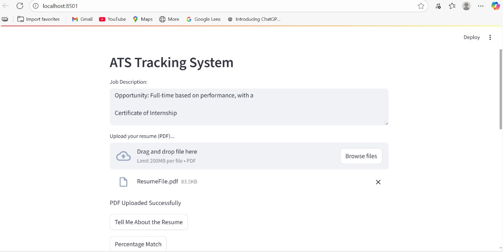

# 📄 ATS Resume Analyzer

A **Streamlit web app** that evaluates resumes against job descriptions using **LangChain** + **Google Gemini API**.  
It mimics ATS systems by providing a **match percentage, keyword analysis, and strengths/weaknesses** of the candidate's resume.

---

## 🚀 Features
- Upload resume (PDF) and paste a job description
- AI-powered evaluation using **Google Gemini API**
- Match percentage scoring
- Missing keywords analysis
- Strengths and weaknesses identification
- Interactive UI built with **Streamlit**

---

## 📂 Tech Stack
- **Python**
- **Streamlit** – Web interface
- **LangChain** – AI orchestration
- **Google Generative AI (Gemini)** – Language model
- **PyPDF2** – PDF text extraction
- **FAISS** – Embeddings and semantic search
- **dotenv** – Environment variable management

---

## ⚙️ Setup Instructions
```bash
# 1. Clone the repository
git clone https://github.com/<your-username>/ats-resume-analyzer.git
cd ats-resume-analyzer

# 2. Create a virtual environment (recommended)
python -m venv venv
source venv/bin/activate   # Linux/Mac
venv\Scripts\activate      # Windows

# 3. Install dependencies
pip install -r requirements.txt

# 4. Add your API key in a .env file
echo "GOOGLE_API_KEY=your_api_key_here" > .env

# 5. Run the Streamlit app
streamlit run app.py
📂 Project Structure
bash
Copy
Edit
ATS-Resume-Analyzer/
│── app.py                # Main Streamlit app
│── requirements.txt      # Python dependencies
│── .env                  # API key (do NOT push to GitHub)
│── README.md             # Project documentation
│── assets/               # Optional: screenshots, images
💡 Future Improvements
Multi-page resume support

Export results as PDF or CSV

Enhanced ATS scoring with skill weighting

User authentication system

Improved UI/UX with more interactive components

👩‍💻 Author
Sanjana Ghadge
📌 Computer Engineering Student | AI & Full Stack Enthusiast

## Preview



